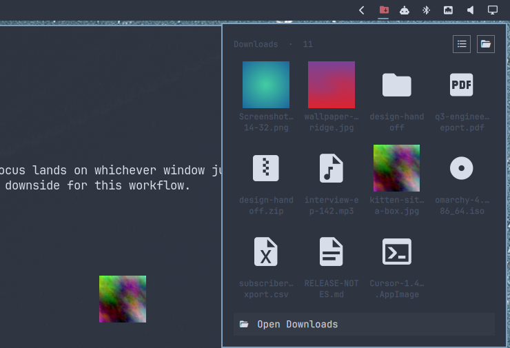
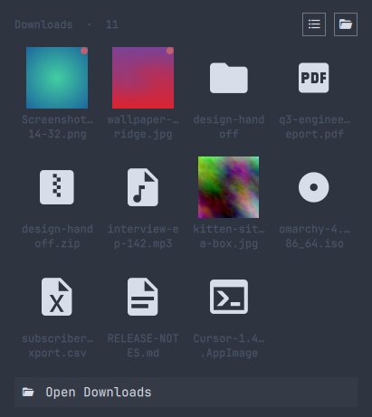
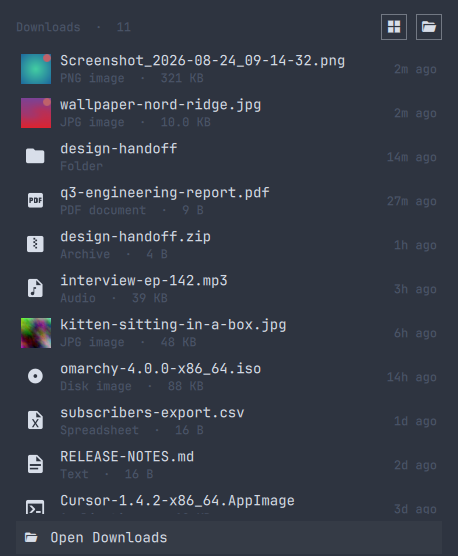
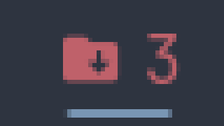

# Downloads Stack for Omarchy

The macOS Dock **Downloads stack**, as an [Omarchy](https://omarchy.org) bar plugin.
A folder icon sits in your bar and counts what just landed. Click it and your recent
downloads fan out — then **drag any file straight into another app**: a browser upload
field, an editor, a chat window, Files. Or click the footer and open the folder.

<p align="center">
  
</p>

This is a Hyprland/Quickshell port of
[plasma-downloads-stack](https://github.com/cromewar/plasma-downloads-stack).

## Install

```sh
omarchy plugin add https://github.com/cromewar/omarchy-downloads-stack.git --enable
```

`omarchy plugin add` clones the repository into
`~/.config/omarchy/plugins/cromewar.downloads-stack`, validates the manifest, asks which
bar section to use (default: right) and enables the widget. If the icon does not show up
straight away, run `omarchy restart shell`.

Move it anywhere on the bar:

```sh
omarchy bar move cromewar.downloads-stack --section left
```

Update later with:

```sh
omarchy plugin update cromewar.downloads-stack
```

## Remove

```sh
omarchy plugin remove cromewar.downloads-stack
```

This unloads the widget from the running shell and deletes the plugin folder. The plugin
keeps no other state: it never writes outside its own folder, and the only configuration it
touches is its own entry in `~/.config/omarchy/shell.json`, which `omarchy plugin enable`
adds and `omarchy plugin remove` drops. Nothing is installed system-wide and no elevated
privileges are used.

## Views

Two layouts, switchable from the popup header or pinned in your config.

| Grid | List |
| :---: | :---: |
|  |  |
| Thumbnails for images, file-type glyphs for everything else | Name, kind, size and how long ago it landed |

The bar icon carries the count of files added since you last looked, tinted with your
theme's active colour:

<p align="center"></p>

## Gestures

| Where | Gesture | Does |
|---|---|---|
| Bar icon | left | open / close the stack |
| Bar icon | right | open the folder in Files |
| Bar icon | middle | mark everything seen (clears the count) |
| File | **drag** | drop the file into any other application |
| File | left | open the file |
| File | right | reveal it in Files |
| File | middle | copy its path to the clipboard |
| Header | grid / list | switch layout for this session |
| Footer | click | open the folder |

Keyboard-only works too — bind this in `~/.config/hypr/bindings.lua`:

```sh
omarchy-shell shell toggle cromewar.downloads-stack '{}'
```

## Settings

Settings live inline on the widget's entry in `~/.config/omarchy/shell.json`:

```json
{ "id": "cromewar.downloads-stack", "view": "list", "maxItems": 20 }
```

| Key | Default | Meaning |
|---|---|---|
| `folder` | `""` | Folder to watch. Empty resolves `XDG_DOWNLOAD_DIR`, falling back to `~/Downloads`. `~` is expanded. |
| `maxItems` | `12` | How many files the stack shows. The rest are counted as "+N more". |
| `view` | `"grid"` | `grid` or `list`. |
| `showHidden` | `false` | Include dotfiles. |
| `badge` | `"new"` | `new` counts files added since you last opened the stack, `count` shows the whole folder, `none` hides it. |
| `closeAfterDrag` | `true` | Close the stack once a file has been dropped. Set `false` to drag several files in a row. |
| `fileManager` | `"nautilus"` | Used by "reveal": `nautilus` selects the file; anything else just opens the folder with `xdg-open`. |

## How it works

- **The drag is a real Wayland drag.** Qt Quick's `Drag.Automatic` starts a
  `wl_data_device` drag from the bar popup's own surface, offering `text/uri-list` and
  `text/plain`. Anything that accepts a file drop accepts these. Only copy and link
  actions are offered — never move — so a file manager can't quietly relocate the file
  out of your Downloads folder.
- **Downloads still in flight are hidden.** `.part`, `.crdownload`, `.opdownload`,
  `.partial`, `.aria2`, `.tmp` and `~`-prefixed files are skipped, so the stack never
  shows a file that can't be dragged yet. They appear the moment the browser renames them.
- **Thumbnails are decoded at display size** for png/jpg/gif/webp/bmp/tiff/ico/avif.
  Everything else gets a Nerd Font glyph in your theme's colours, so no icon theme is
  needed.
- **Colours, font and corner radius** all come from the active Omarchy theme.

## Requirements and dependencies

- Omarchy 4.x (Quickshell shell) on Hyprland.
- A Nerd Font as the bar font (Omarchy's default) for the file-type glyphs.
- `wl-clipboard` (`wl-copy`) for middle-click copy-path. Ships with Omarchy.
- `xdg-open` to open files and folders. Ships with Omarchy.
- `nautilus` (optional) so "reveal in Files" can select the file; any other file manager
  falls back to opening the folder via `xdg-open`.

The plugin is pure QML/JavaScript: nothing is compiled, downloaded or installed beyond the
plugin folder itself.

## Troubleshooting

**A change to the plugin doesn't show up.** Bar widgets do not reliably hot-reload even
though the shell logs `Local plugin changed, reloading`. Run `omarchy restart shell`.

**The icon isn't in the bar.** Check `omarchy plugin list | grep downloads`. If it says
`disabled`, the shell had not yet picked up the new folder when it was enabled. Rescan,
then enable:

```bash
omarchy-shell shell rescanPlugins
omarchy plugin enable cromewar.downloads-stack
omarchy restart shell
```

## License

GPL-3.0-or-later, matching the Plasma original.
